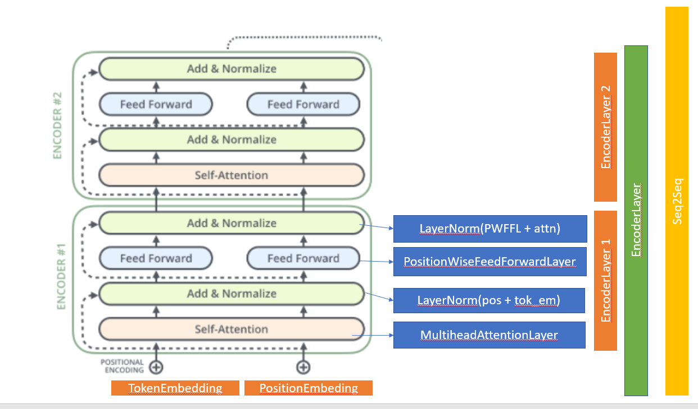

# Transformer Implementation using PyTorch

[notebook](./assignment_transformers_session10.ipynb)  for implementation transformer models using PyTorch

## Blogs I have enjoyed reading and understanding
1. http://peterbloem.nl/blog/transformers
2. [Illustrated Transformer](http://jalammar.github.io/illustrated-transformer/)

all understanding, images are from above two blogs.

## Implementation of language translation model from Frech to English translation

Class used: [IWSLT2016](https://pytorch.org/text/stable/datasets.html#id17)
Reduced Vocabulary - buld_vocab considered min_freq as 2, there 15 million+ parameters to be learned with same class, hence reduced the dimesion

# Following are the logs

```
Epoch: 1, Train loss: 2.891, Train PPL:  18.011 | Val loss: 2.246, Val. PPL:   9.448 | Epoch time = 328.511s
Epoch: 2, Train loss: 2.195, Train PPL:   8.979 | Val loss: 1.918, Val. PPL:   6.809 | Epoch time = 325.406s
Epoch: 3, Train loss: 1.991, Train PPL:   7.319 | Val loss: 1.786, Val. PPL:   5.963 | Epoch time = 324.587s
Epoch: 4, Train loss: 1.877, Train PPL:   6.536 | Val loss: 1.710, Val. PPL:   5.527 | Epoch time = 324.164s
Epoch: 5, Train loss: 1.804, Train PPL:   6.074 | Val loss: 1.663, Val. PPL:   5.275 | Epoch time = 318.135s
Epoch: 6, Train loss: 1.751, Train PPL:   5.758 | Val loss: 1.622, Val. PPL:   5.062 | Epoch time = 316.352s
Epoch: 7, Train loss: 1.709, Train PPL:   5.522 | Val loss: 1.595, Val. PPL:   4.927 | Epoch time = 314.859s
Epoch: 8, Train loss: 1.674, Train PPL:   5.336 | Val loss: 1.575, Val. PPL:   4.831 | Epoch time = 313.817s
Epoch: 9, Train loss: 1.644, Train PPL:   5.176 | Val loss: 1.555, Val. PPL:   4.734 | Epoch time = 314.255s
Epoch: 10, Train loss: 1.619, Train PPL:   5.046 | Val loss: 1.541, Val. PPL:   4.670 | Epoch time = 313.097s

```

## Class Design used


This is just to understand the code, check the [notebook](./assignment_transformers_session10.ipynb) for implementation


